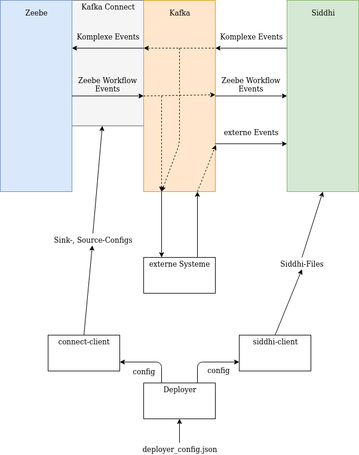

# Meta

Hier können wir alle möglichen MetaKram sammeln bevor wir alles in einzelne Repos aufsplitten.

## Checkliste Dokumentation

für eure Dokumentation würden wir euch bitte zwei potentielle Zielgruppe im Auge zu haben:  
1.  Potentielle Endanwender
2. Entwickler die eure Software nutzen wollen.
  
Für 1.) solltet ihr folgende Dinge in eure Dokumentation integrieren:

- [ ] Produktvision
     - [ ] Funktionalität von Zeebe um CEP erweitern
     - [ ] Diese Funktionalität einfach nutzbar zu machen
     - [ ] Cloud Native

Workflow-Engines sind Softwaresysteme zur Überwachung und Steuerung von Prozessen basierend
auf einem Modell. Während man in der Vergangenheit häufig nur einfache Geschäftsprozesse über
Workflows abgewickelt hat, werden nach und nach die Anforderungen in Punkten wie
beispielsweise Geschwindigkeit und Parallelität immer höher durch neue Anwendungsgebiete.
Aus diesen Anwendungsgebieten gehen momentan leistungsfähigere Workflow-Engines, wie Zeebe,
hervor.  
Diese Workflow-Engines sind allerdings auf sehr atomare Formen von Events beschränkt und
erfordern somit teils sehr umständliche Modellierungen, um komplexere Zusammenhänge zwischen
Events darzustellen. Um diese Komplexität besser handhaben zu können, kann man Complex Event
Processing (CEP) einsetzen. Dieses ermöglicht es Daten in sinnvolle Informationen umzuwandeln
und atomare Events in komplexe Events zu fassen.  
Dieses Produkt setzt die Zusammenschaltung zwischen der Workflow-Engine Zeebe und der
CEP-Engine Siddhi um. Hierbei ermöglicht es auf eine einfache Weise CEP-Funktionalitäten in
Zeebe-Workflows einzusetzen. (**TODO**: Irgendwas zu Cloud Native, Talken wir auch über
Kafka als Möglichkeit neue Features zu integrieren?)

- [ ] Beschreibung des Systemumfangs
     - [ ] Machbarkeitsstudie
     - [ ] Docker-compose file + deployer als Ready-To-Deploy System
     - [ ] Deployer + Deployer Libraries

Das System beinhaltet eine docker-compose Datei, um die verschiedenen Module hochzufahren
und zu verbinden, sowie ein Deployer-Programm, welches die Möglichkeit bereitstellt
Siddhi-Files hochzufahren und mit Zeebe-Workflows über Kafka zu verbinden.   
Zudem stellt der Deployer Java-Libraries zu Verfügung, um Siddhi-Files in der Laufzeit
dynamisch hochzufahren und herunterzufahren.  
Des weiteren enthält das System eine Machbarkeitsstudie in Form einer realisierten Anbindung
eines einfachen Workflows mit einem Siddhi-File.

 - [ ] Mini-Tutorial -> Beispielhafte Darstellung der Anwendungsfälle mir Screenshots
(**TODO**: Mini-Tutorial eventuell erst nach Architektur-Doku?)
     - [ ] Beispiel zum laufen kriegen
     - [ ] Beispiel dokumentieren
     - [ ] Python (für Beispiel)
     
     #### Tutorial
     Zum kompilieren des Deployers muss im Monorepo Ordner `mvn clean package` ausgeführt werden.
     Zum Starten muss `java -jar deployer/target/deployer-0.0-SNAPSHOT-jar-with-dependencies.jar
     -deploy deployer/deployer_config.json` ausgeführt werden.
Für 2.):

- [ ] Systemanforderungen
   - [ ] Docker
   - [ ] Java
   - [ ] welche Versionen
- [ ] Beschreibung des Setups
   - [ ] Startup skript ausbauen und dokumentieren
- [ ] Architekturdokumentation
    - [x] Diagramm
    - [x] Kafka erklären
    - [x] kafka-connect-zeebe
    - [ ] Deployer Struktur        
    - [x] Clients als Library einzeln verwendbar
    
    #### Architektur
    
        
    Die Workflow-Engine Zeebe und die CEP-Engine Siddhi werden über Kafka verbunden.
    Die nötigen Konfiguration die über docker-compose hinausgeht wird von unserer Anwendung Deployer übernommen. 
    ##### Apache Kafka
    Apache Kafka ist ein System, das eine Schnittstelle für Datenströme verschiedener Systeme bereitstellt.
    In unserem Fall werden explizite Zeebe Workflow Events und externe Events an Kafka übergeben,
    um dann von Siddhi gelesen zu werden, um komplexe Events zu erkennen.
    Siddhi übergibt die erkannten komplexen Events an Kafka, von wo sie von Zeebe gelesen werden und
    dann entsprechend in Workflowinstanzen behandelt werden.  
    Der Vorteil Kafka statt einer eigenen Lösung zur Verbindung von Siddhi und Zeebe zu nutzen, ist,
    dass erstens für die verschiedenen notwendigen Operationen (Zeebe-zu-Kafka, Kafka-zu-Zeebe,
    Siddhi-zu-Kafka, Kafa-zu-Siddhi) schon Lösungen existieren, die genutzt werden können.
    Zweitens ist es so ohne größeres Refactoring mögliche externe Systeme an die verschiedenen Datenströme
    anzuschließen, so können z.B. erkannte komplexe Events in einer Datenbank geloggt werden.
    ##### Kafka-Siddhi-Verbindung
    Siddhi benötigt nur noch einige JARs um die [siddhi-io-kafka](https://siddhi-io.github.io/siddhi-io-kafka/)
    Extension benutzen zu können.
    Die Verbindung zwischen Kafka und Siddhi wird deshalb über (**TODO**:docker-compose/docker-files?) gelöst. 
    ##### Kafka-Zeebe-Verbindung
    Die Verbindung zwischen Kafka und Zeebe wird mithilfe eine Kafka Connect Connectors realisiert.
    [kafka-connect-zeebe](https://github.com/zeebe-io/kafka-connect-zeebe) erlaubt es Nachrichten von
    Zeebe-Workflow-Instanzen auf ein Kafka-Topic zu schreiben.
    Außerdem können Nachrichten von einem Kakfa-Topic an ein Workflow übergeben werden.  
    Dafür müssen von kafka-zeebe-connect benutzte Source- und Sink-Connector entsprechend den Workflows und
    Siddhi-Files konfiguriert werden. Dafür wird von uns eine Library, den Connect-Client, bereitgestellt,
    dessen Schnittstelle ausführlich unter **Schnittstellen, Connect-Client** beschrieben wird.
    ##### Siddhi Konfiguration
    An Siddhi müssen die entsprechenden Siddhi-Files übergeben werden.
    Dazu stellen wir eine Bibliothek, den Siddhi-Client zur Verfügung,
    die es erlaubt einfach die zu nutzenden Siddhi-Files an Siddhi zu senden.
    Die Schnittelle ist genauer unter **Schnittstellen, Siddhi-Client** beschrieben:
    ##### Deployer
    In den meisten Anwendungfällen ist es ausreichend auf die Funktionalität von Connect-Client und Siddhi-Client
    über den Deployer zuzugreifen.  
    Der Deployer ermöglicht es über eine einzelne relativ einfache JSON Textdatei sowohl Siddhi als auch
    kafka-connect-zeebe zu konfigurieren. Die genaue Form der JSON-Datei ist auch
    unter **Schnittstellen, Deployer** beschrieben.
- [ ] Verwendete Technologien/Ansätze
   - [ ] Apache Docker
   - [x] Apache Java
   - [ ] Apache Maven
   - [ ] Apache JSon
   - [ ] Apache Retrofit
   - [x] Apache Zeebe
   - [ ] Apache Siddhi
   - [ ] Apache Kafka
   - [ ] Apache Kafka Connect
   - [ ] (Apache Apache)
   (**TODO**: alles noch um MongoDB ergänzen, falls wir das am Ende benutzen)
   
   #### Verwendete Technologien/Ansätze
   (**TODO**: das hier sind nur Prototypische Beschreibungen, damit wir irgendwas erstmal haben)
   ##### Docker
   (**TODO**: das hier ist einfach ein wikipedia copy paste ACHTUNG)  
   Docker vereinfacht die Bereitstellung von Anwendungen, weil sich Container, die alle nötigen Pakete enthalten,
   leicht als Dateien transportieren und installieren lassen. Container gewährleisten die Trennung und
   Verwaltung der auf einem Rechner genutzten Ressourcen. Das beinhaltet laut Aussage der Entwickler:
   Code, Laufzeitmodul, Systemwerkzeuge, Systembibliotheken – alles was auf einem Rechner installiert werden kann.  
   Docker wird von uns benutzt, um Zeebe, Kafka, Kafka-Connect, Siddhi und jeweils deren
   Abhängigkeiten zu starten.
   ##### Java
   Java ist eine objekorientierte Programmiersprache, die von einem Übersetzerprogramm in Bytecode übersetzt, der
   dann von einer Java-Laufzeitumgebung unabhänig von der ausführenden Hardware ausgeführt werden kann.  
   Unser Deployer, der Siddhi-Client und der Connect-Client sind in Java geschrieben.
   ##### Apache Maven
   (**TODO**: das hier ist einfach ein wikipedia copy paste ACHTUNG)  
   Maven ist ein Build-Management-Tool der Apache Software Foundation und basiert auf Java.
   Mit ihm kann man insbesondere Java-Programme standardisiert erstellen und verwalten.  
   Wir benutzen Maven für den Build-Prozess unseres Deployers und den Bibliotheken dazu.
   ##### JSON/JavaScript Object Notation
   (**TODO**: das hier ist einfach ein copy paste von [hier](https://www.json.org/json-de.html) ACHTUNG)  
   JSON (JavaScript Object Notation) ist ein schlankes Datenaustauschformat, das für Menschen einfach zu lesen und
   zu schreiben und für Maschinen einfach zu parsen (Analysieren von Datenstrukturen) und zu generieren ist.
   Es basierd auf einer Untermenge der JavaScript Programmiersprache.  
   Die Konfiguration unseres Deployers wird über eine JSON Schnittstelle erledigt.
   ##### Retrofit
   [Ein typensicherer HTTP-Client für Java.](https://square.github.io/retrofit/), unser
   Siddhi-Client und unser Connect-Client benutzen Retrofit, um mit Siddhi, b.z.w Kafka-Connect
   zu kommunizieren.
   ##### Zeebe
   Zeebe ist ein in Java geschriebenes freies Workflow-Management-System, mit dem Geschäftsprozesse in BPMN 2.0 definiert und ausgeführt werden können.
   ##### Siddhi
   Siddhi ist ein Complex-Event-Processing System, das erlaubt mit einer SQL-ähnlichen Scriptsprache komplexe
   Ereignisse zu definieren und aus Datenströmen diese zu erkennen.
   ##### Apache Kafka
   (**TODO**: das hier ist einfach ein wikipedia copy paste ACHTUNG)  
   Apache Kafka ist ein Open-Source-Software-Projekt der Apache Software Foundation, das insbesondere der
   Verarbeitung von Datenströmen dient. Kafka ist dazu entwickelt, Datenströme zu speichern und zu verarbeiten,
   und stellt eine Schnittstelle zum Laden und Exportieren von Datenströmen zu Drittsystemen bereit.
   Die Kernarchitektur bildet ein verteiltes Transaktions-Log.  
   Kafka ist in unserer Architektur der zentrale Kommunikation-Kanal zwischen Zeebe und Siddhi.
   ##### Kafka Connect
   (**TODO**: das hier ist einfach ein wikipedia copy paste ACHTUNG)  
   Kafka Connect bietet eine Schnittstelle zum Laden/Exportieren von Daten aus/in Drittsysteme.
   Kafka Connect führt sogenannte Konnektoren aus, welche die eigentliche
   Kommunikation mit dem Drittsystem übernehmen.
   Dabei definiert die Connect-API die Programmierschnittstellen, die von einem Connector implementiert
   werden müssen. Es gibt bereits viele frei verfügbare und kommerzielle Konnektoren, die genutzt werden können.
   Apache Kafka liefert selbst keine produktreifen Konnektoren.  
   Kafka Connect macht es uns wesentlich einfacher eine Verbindung zwischen Kafka und Zeebe
   herzustellen.

   
- [ ] Schnittstellenbeschreibung
   - [x] JSON-Deployer-Config
   - [x] Connect-Client Schnitstellen
   - [ ] Siddhi-Client Schnitstellen
   #### Schnittstellen
   ##### Deployer
   Der Deployer ist eine Java Anwendung an die eine JSON Konfigurationsdatei übergeben wird, die Siddhi und
   die Verbindung zwischen Zeebe und Kafka beschreibt.  
   Zum Erstellen einer Konfiguration:
   ```
   java -jar ./deployer/target/deployer-0.0-SNAPSHOT.jar -deploy deployer_config.json
  ```  
  Zum Entfernen einer Konfiguration:
   ```
   java -jar ./deployer/target/deployer-0.0-SNAPSHOT.jar -remove deployer_config.json
  ```  
  Eine Config-Datei muss folgendermaßen aussehen (C-Style Kommentare beschreiben die einzelnen Felder,
  müssen jedoch vor Benutzung entfernt werden): (**TODO**: Feldernamen anpassen, Übereinstimmung mit aktueller Version)
  ```
  {
    "connector_config":
    {
      "connector_host": "localhost", //kafka-connect hostname
      "connector_port": "8083", //kafka-connect port
      "zeebe_client_broker_contactPoint": "zeebe:26500", // selbsterklärend, hostname:port
      "source_configs": // Array, das alle Kafka-Connect Source Configs enthält
      [
        { // Kafka-Connect Source Config
          "name": "ping", // eindeutiger Name dieser Konfiguration
          "job_types": "ping", // in einer bpmn-Datei muss dieses Feld mit dem type der "zeebe:taskDefinition" übereinstimmen
          "job_header_topics": "topic" // in einer bpmn-Datei unter einer taskDefinition mit dem type job_type, muss unter zeebe:taskHeaders bei einem zeebe:header mit key="kafka-topic" das value mit diesem Feld übereinstimmen
        }
      ],
      "sink_configs":
      [
        {
          "name": "pong", // eindeutiger Name dieser Konfiguration
          "topics": "toZeebe", // Kafka-Topic, von dem gelesen wird
          "message_path_messageName": "$.name", // Die folgenden Felder beschreiben, wie eine Nachricht, die von dem oben benannten Topic gelesen wird, in bestimmte Objekte im Zeebe-Workflow gemappt werden
          "message_path_correlationKey": "$.key",
          "message_path_variables": "$.payload",
          "message_path_timeToLive": "$.ttl"
        }
      ]
    },
    "siddhi_config":
    {
      "hostaddress": "https://localhost:9443/", // hostname:port von dem Siddhi-System
      "siddhi-files": ["sampleFiles/pingpong/KafkaTest.siddhi"] // Array aus Siddhi-Files, die geladen werden sollen
    }
  }
  ```
  Weitere speziellere Eigenschaften zu dem Kafka-Connect-Zeebe kann man hier finden:
  https://github.com/zeebe-io/kafka-connect-zeebe
  ##### Connect-Client
  Der Connect-Client kann auch über ein Java-Programm als Bibliothek benutzt werden.
  Es wird eine Klasse `ConnectClient` bereitgestellt, der Konstruktor nimmt ein Konfigurationsklasse
  `ConnectConfig`, die z.B. mithilfe von [Jackson](https://github.com/FasterXML/jackson) aus einer
  json-Textdatei befüllt werden kann, als Parameter.  
  Die beiden Memberfunktionen `deploy()`, `delete()` setzen diese Konfiguration ein, b.z.w entfernen sie wieder
  aus dem laufenden Kafka-Connect System.  
  Die Bedeutungen der verschiedenen Felder in der `ConnectConfig` stimmen mit den Bedeutungen überein,
  die unter **Schnittstellen, Deployer** bezüglich des `"connector_config"` JSON-Felds genannt wurden.  
  Der Sourcecode des [Deployers](./deployer/src/main/java/berlin/hu/cep/Deployer.java) soll hier als weitere
  Dokumentation dienen. 
  ##### Siddhi-Client
  **TODO**  
  Der Sourcecode des [Deployers](./deployer/src/main/java/berlin/hu/cep/Deployer.java) soll hier als weitere Dokumentation dienen.
  
   
- [ ] Offene Punkte/Einschränkungen/Systemgrenzen
   - [ ] Config zur Zeit nur statisch und nicht zur Laufzeit anpassbar
   - [x] Zeebe Exporter nach Siddhi schicken
       - [x] Protobuf in Siddhi 
   - [ ] Immer nur mit Kafka im Compose File getestet
   - [x] Keine Tests im Deployer
   - [x] Zeebe Integration in den Deployer
   
   #### Offene Punkte/Einschränkungen/Systemgrenzen
   
   ##### Statische Konfiguration
   (**TODO**: Ergibt das Sinn? Könnte man nicht einfach während der Runtime zumindestens
   mit dem Deployer eine neue Konfiguration pushen?/Worauf bezieht sich das "statisch"?) 
   Unser System baut darauf auf, die Konfiguration aller beteiligten Anwendungen ausschließlich
   zu Beginn der Benutztung durchzuführen. Eine neue Konfiguration kann nicht z.B. durch Events
   während des Betriebs eingeführt werden.
   
   ##### Zeebe Kafka Record Exporter
   Mit unserem System müssen alle Zeebe-Events explizit im BPMN-Worklow angegeben werden.
   Zeebe stellt in Exportern sogenannte Records zur Verfügung, die Informationen über den
   Zustand von Workflow-Instanzen geben, ob z.B. ein bestimmter Job beendet wurde.  
   Diese Record könnten zusätzlich zu den expliziten Events über Kafka an Siddhi gesendet werden.
   Zeebe stellt sogar schon [eine einfache Implementation](https://github.com/zeebe-io/zeebe-kafka-exporter)
   für einen Zeebe-Exporter, der Zeebe-Records in einem Protobuf Schema auf ein Kafka-Topic
   schreibt.  
   Siddhi, b.z.w. die Siddhi-Files, muss dann zusätzlich noch konfiguriert um Protobufs
   erkennen zu können.
   
   ##### Deployer Verbesserungen
   Im Deployer und in den Client Bibliotheken wird nur bedingt auf Fehler getestet und nur
   primitive Fehlernachrichten ausgegeben.  
   So könnten z.B. der Connect-Client und der Siddhi-Client noch bessere Fehleranalysen
   betreiben bezüglich der Verbindung zu dem Siddhi-Host/Kafka-Connect-Host.  
   Eine weitere Verbesserung dieser Clienten wäre, mithilfe der BPMN-Workflow Dateien, die
   eingesetzt werden sollen, einen Sanity-Check durchzuführen, um zu überprüfen, ob es
   offensichtliche Ungereimtheiten in den Siddhi-Files oder in der Kafka-Connect Konfiguration
   gibt.  
   Eventuell kann es sinnvoll sein, den Deployer mit einem Zeebe-Clienten zu erweitern, der
   sich um die BPMN-Workfows kümmert, was vor allem nützlich sein kann, wenn die oben
   angesprochenen Überprüfung der Konfiguration anhand der BPMN-Workflows eingesetzt wird.
   
   ##### Ausführliches Testen
   Wir haben unser System nur in der bereitgestellten Zusammenstellung getestet.
   So bleibt zum Beispiel offen, ob es in der Praxis auch mit Kafka funktioniert, wenn Kafka nicht über
   docker-compose gestartet wurde.
   
   
- [ ] Link zum Source Code
    - [ ] Umstrukturieren des Deployers zu einem Repo
    - [ ] Link zum diesem neuen Repo in die Doku
- [ ] Lizenzierung
    - [ ] haben wir irgendwas zu beachten mit den Sachen die wir benutzen?  
    Eigentlich nicht, oder, ich meine wir haben ja nur config-files für docker und maven
    und halt unseren eigene Javaspaghettisuppe.
    - [ ] MIT?  
    **Begin license text.**
    
    Copyright 2020 Spiderman(**TODO**)
    
    Permission is hereby granted, free of charge, to any person obtaining a copy of this software and associated documentation files (the "Software"), to deal in the Software without restriction, including without limitation the rights to use, copy, modify, merge, publish, distribute, sublicense, and/or sell copies of the Software, and to permit persons to whom the Software is furnished to do so, subject to the following conditions:
    
    The above copyright notice and this permission notice shall be included in all copies or substantial portions of the Software.
    
    THE SOFTWARE IS PROVIDED "AS IS", WITHOUT WARRANTY OF ANY KIND, EXPRESS OR IMPLIED, INCLUDING BUT NOT LIMITED TO THE WARRANTIES OF MERCHANTABILITY, FITNESS FOR A PARTICULAR PURPOSE AND NONINFRINGEMENT. IN NO EVENT SHALL THE AUTHORS OR COPYRIGHT HOLDERS BE LIABLE FOR ANY CLAIM, DAMAGES OR OTHER LIABILITY, WHETHER IN AN ACTION OF CONTRACT, TORT OR OTHERWISE, ARISING FROM, OUT OF OR IN CONNECTION WITH THE SOFTWARE OR THE USE OR OTHER DEALINGS IN THE SOFTWARE.
    
    **End license text.**
