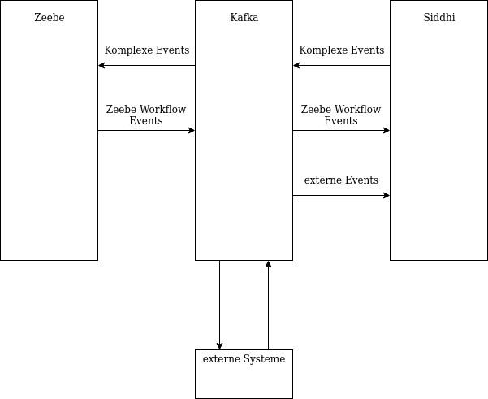

# Meta

Hier können wir alle möglichen MetaKram sammeln bevor wir alles in einzelne Repos aufsplitten.

## Checkliste Dokumentation

für eure Dokumentation würden wir euch bitte zwei potentielle Zielgruppe im Auge zu haben: 1.) Potentielle Endanwender 2.) Entwickler die eure Software nutzen wollen.

Für 1.) solltet ihr folgende Dinge in eure Dokumentation integrieren:

- [ ] Produktvision
     - [ ] Funktionalität von Zeebe um CEP erweitern
     - [ ] Diese Funktionalität einfach nutzbar zu machen
     - [ ] Cloud Native

Workflow-Engines sind Softwaresysteme zur Überwachung und Steuerung von Prozessen basierend auf einem Modell. Während man in der Vergangenheit häufig nur einfache Geschäftsprozesse über Workflows abgewickelt hat, werden nach und nach die Anforderungen in Punkten wie beispielsweise Geschwindigkeit und Parallelität immer höher durch neue Anwendungsgebiete. Aus diesen Anwendungsgebieten gehen momentan leistungsfähigere Workflow-Engines, wie Zeebe, hervor.
Diese Workflow-Engines sind allerdings auf sehr atomare Formen von Events beschränkt und erfordern somit teils sehr umständliche Modellierungen, um komplexere Zusammenhänge zwischen Events darzustellen. Um diese Komplexität besser handhaben zu können, kann man Complex Event Processing (CEP) einsetzen. Dieses ermöglicht es Daten in sinnvolle Informationen umzuwandeln und atomare Events in komplexe Events zu fassen.
Dieses Produkt setzt die Zusammenschaltung zwischen der Workflow-Engine Zeebe und der CEP-Engine Siddhi um. Hierbei ermöglicht es auf eine einfache Weise CEP-Funktionalitäten in Zeebe-Workflows einzusetzen. (TODO: Irgendwas zu Cloud Native, Talken wir auch über Kafka als Möglichkeit neue Features zu integrieren?)

- [ ] Beschreibung des Systemumfangs
     - [ ] Machbarkeitsstudie
     - [ ] Docker-compose file + deployer als Ready-To-Deploy System
     - [ ] Deployer + Deployer Libraries

Das System beinhaltet eine docker-compose Datei, um die verschiedenen Module hochzufahren und zu verbinden, sowie ein Deployer-Programm, welches die Möglichkeit bereitstellt Siddhi-Files hochzufahren und mit Zeebe-Workflows über Kafka zu verbinden.
Zudem stellt der Deployer Java-Libraries zu Verfügung, um Siddhi-Files in der Laufzeit dynamisch hochzufahren und herunterzufahren.
Des weiteren enthält das System eine Machbarkeitsstudie in Form einer realisierten Anbindung eines einfachen Workflows mit einem Siddhi-File.

 - [ ] Mini-Tutorial -> Beispielhafte Darstellung der Anwendungsfälle mir Screenshots
     -  [ ] Beispiel zum laufen kriegen
     - [ ] Beispiel dokumentieren
     - [ ] Python (für Beispiel)

Für 2.):

- [ ] Systemanforderungen
   - [ ] Docker
   
   xkcd.com/1988
   - [ ] Java
- [ ] Beschreibung des Setups
   - [ ] Startup skript ausbauen und dokumentieren
- [ ] Architekturdokumentation
    - [ ] Diagramm
        
    - [ ] Kafka erklären
    
    Apache Kafka ist ein System, das eine Schnittstelle für Datenströme verschiedener Systeme bereitstellt. In unserem Fall werden explizite Zeebe Workflow Events und externe Events an Kafka übergeben, um dann von Siddhi gelesen zu werden, um komplexe Events zu erkennen. Siddhi übergibt die erkannten komplexen Events an Kafka, von wo sie von Zeebe gelesen werden und dann entsprechend in Workflowinstanzen behandelt werden.  
    Der Vorteil Kafka statt einer eigenen Lösung zu Verbindung von Siddhi und Zeebe zu nutzen, ist, dass erstens schon für die verschiedenen notwendigen Operationen (Zeebe-zu-Kafka, Kafka-zu-Zeebe, Siddhi-zu-Kafka, Kafa-zu-Siddhi) schon Lösungen existieren, die genutzt werden können. Zweitens ist es so ohne größeres Refactoring mögliche externe Systeme an die verschiedenen Datenströme anzuschließen, so können z.B. erkannte komplexe Systeme in einer Datenbank geloggt werden.
    
    Die Verbindung zwischen Kafka und Siddhi wird über (TODO:docker-compose/docker-files?) gelöst; Siddhi benötigt nur noch einige JARs um die [siddhi-io-kafka](https://siddhi-io.github.io/siddhi-io-kafka/) Extension benutzen zu können.  
    Die Verbindung zwischen Kafka und Zeebe wird mit [kafka-connect-zeebe](https://github.com/zeebe-io/kafka-connect-zeebe) realisiert. Dafür müssen von kafka-zeebe-connect benutzte Source- und Sink-Connector entsprechend den Workflows und Siddhi-Files konfiguriert werden.
    - [ ] Kafka connect
    
    (TODO: was ist mit dem Stichpunkt genau gemeint, soll hier kafka-connect-zeebe (das github projekt das wir benutzen) beschrieben werden?)    
    - [ ] Deployer Struktur
     
        
    - [ ] Clients als Library einzeln verwendbar
- [ ] Verwendete Technologien/Ansätze
   - [ ] Apache Docker
   - [ ] Apache Java
   - [ ] Apache Maven
   - [ ] Apache JSon
   - [ ] Apache Retrofit
   - [ ] Apache  Zeebe
   - [ ] Apache Siddhi
   - [ ] Apache Kafka
   - [ ] Apache Kafka Connect
   - [ ] (Apache Apache)
- [ ] Schnittstellenbeschreibung
   - [ ] JSON-Deployer-Config
   - [ ] Deployerlibrary Schnittstellen
- [ ] Offene Punkte/Einschränkungen/Systemgrenzen
   - [ ] Config zur Zeit nur statisch und nicht zur Laufzeit anpassbar
   - [ ] Zeebe Exporter nach Siddhi schicken
       - [ ] Protobuf in Siddhi 
   - [ ] Immer nur mit Kafka im Compose File getestet
   - [ ] Keine Tests im Deployer
   - [ ] Zeebe Integration in den Deployer
- [ ] Link zum Source Code
    - [ ] Umstrukturieren des Deployers zu einem Repo
    - [ ] Link zum diesem neuen Repo in die Doku
- [ ] Lizenzierung
    - [ ] MIT?
