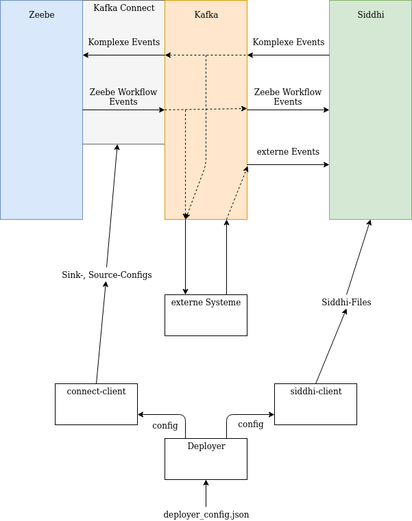

# Architektur

## 4.1 Überblick

Die Workflow-Engine Zeebe und die CEP-Engine Siddhi werden über Kafka verbunden.
Alle Konfiguration, die über das Starten der Container hinausgeht, wird von unserer Anwendung Deployer übernommen.

## 4.2 Kafka

Apache Kafka ist ein System, das eine Schnittstelle für Datenströme verschiedener Systeme bereitstellt. Die Datenströme stellt es in sogenannten **Kafka-Topics** zur Verfügung. **Producer** schreiben Daten in ein oder mehrere **Kafka-Topics**, **Consumer** abonnieren ein oder mehrere **Kafka-Topics** und verarbeiten die darüber gesendeten Daten.  
In unserem Fall werden explizite Zeebe Workflow Events und externe Events an Kafka übergeben, um dann von Siddhi gelesen zu werden, sodass komplexe Events erkannt werden können. Siddhi übergibt die erkannten komplexen Events an Kafka, von wo sie von Zeebe gelesen werden und dann entsprechend in Workflowinstanzen behandelt werden.  
Der Vorteil Kafka statt einer eigenen Lösung zur Verbindung von Siddhi und Zeebe zu nutzen, ist, dass für die verschiedenen notwendigen Operationen ([Zeebe-zu-Kafka](https://github.com/zeebe-io/kafka-connect-zeebe), [Kafka-zu-Zeebe](https://github.com/zeebe-io/kafka-connect-zeebe), [Siddhi-zu-Kafka](https://siddhi-io.github.io/siddhi-io-kafka/), [Kafka-zu-Siddhi](https://siddhi-io.github.io/siddhi-io-kafka/)) schon Lösungen existieren, die genutzt werden können. Zusätzlich ist es ohne größeres Refactoring mögliche externe Systeme an die verschiedenen Datenströme anzuschließen. So können z.B. erkannte komplexe Events in einer Datenbank geloggt werden.

## 4.3 Kafka Zeebe Verbindung

Die Verbindung zwischen Kafka und Zeebe wird mithilfe eines Kafka-Connect-Connectors realisiert. [kafka-connect-zeebe](https://github.com/zeebe-io/kafka-connect-zeebe) erlaubt es Nachrichten von Zeebe-Workflow-Instanzen auf ein Kafka-Topic zu schreiben. Außerdem können Nachrichten von einem Kakfa-Topic an ein Workflow übergeben werden. Dafür müssen von kafka-zeebe-connect benutzte Source- und Sink-Connectors entsprechend des Workflows und der Siddhi-Files konfiguriert werden. Dafür wird von uns eine Library, den Connect-Client, bereitgestellt, dessen Schnittstelle ausführlich unter [Schnittstellen](06. Schnittstellen#62-connect-client) beschrieben wird.

## 4.4 Kafka Siddhi Verbindung

Die Verbindung zwischen Siddhi und Kafka wird durch die [siddhi-io-kafka](https://siddhi-io.github.io/siddhi-io-kafka/) Extension ermöglicht. Diese ist Teil der Standardinstallation von Siddhi, benötigt aber noch einige JARs aus der Kafka-Distribution, bevor man sie verwenden kann.
Wir stellen diese JARs bereit, indem wir das Standard Siddhi Dockerimage um diese JARs erweitern.

## 4.5 Siddhi Konfiguration

An Siddhi müssen die entsprechenden Siddhi-Files übergeben werden. Dazu stellen wir eine Bibliothek, den Siddhi-Client zur Verfügung, die es erlaubt einfach die zu nutzenden Siddhi-Files an Siddhi zu senden. Die Schnittelle ist genauer unter [Schnittstellen](06. Schnittstellen#63-siddhi-client) beschrieben.

## 4.6 Deployer

In den meisten Anwendungfällen ist es ausreichend auf die Funktionalität von Connect-Client und Siddhi-Client über den Deployer zuzugreifen. Der Deployer ermöglicht es über eine einzelne, einfache JSON Textdatei sowohl Siddhi als auch kafka-connect-zeebe zu konfigurieren. Die genaue Form der JSON-Datei ist unter [Schnittstellen](06. Schnittstellen#61-deployer) beschrieben.

## 4.7 Externes System - MongoDB

Optional kann alle Kommunikation über Kafka zwischen Zeebe und Siddhi von einer [MongoDB](https://www.mongodb.com/) gespeichert werden. Der Deployer konfiguriert hierfür einen weitern Kafka-Connector und das externe System MongoDB.  
Akutell ist MongoDB das einzige unterstützte externe System.
